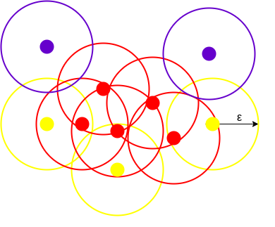

```{r setup, include=FALSE}
knitr::opts_chunk$set(cache = TRUE, warning = FALSE, 
                      message = FALSE, cache.lazy = FALSE)
```

```{r, echo = FALSE}
library(data.table)
library(reticulate)
library(dplyr)
library(shiny)
library(ggplot2)
library(lubridate)
library(stringr)
library(rvest)
library(benford.analysis)
library(fpc)
library(dbscan)
library(factoextra)
library(solitude)
library(caret)
library(reshape2)
library(devtools)
library(inspectdf)
library(scatterplot3d)
library(jpeg)
library(imager)
library(flextable)
library(shinythemes)
library(kableExtra)
```

## Introduction

```{r, echo=FALSE}
intro_Df = data.frame("topic" = c("Education", "Current Role",
                                  rep("Internal Development", 5),
                                  rep("Client Projects", 2),
                                  rep("Hobbies", 3)),
                      "answer" =  
                        c("BS Statistics, University of Illinois at Urbana Champaign, 2019",
                                  "Senior 1, Audit Analytics, Deloitte US",
                          "Developed R Package for DWW", "WebApp for Memo Automation",
                            "Data Read In Process Automation",
                            "Fuzzy Match/Web Scraping - Alteryx", "R Trainings",
                          "TMT - SSP, Revenue Recalculation",
                            "Retail - Custom & Standard Analytics",
                      "Running", "Watching Cricket/ Soccer", "Cooking"))


intro_ft = flextable(intro_Df)
intro_ft %>% 
  merge_v(j = 1, target = "topic") %>%
  set_header_labels(topic = " ", answer = " ") %>% 
  theme_vanilla() %>% 
  autofit()
```


# Problem 1: Data Loading, Preparation, Summarizing {.small}

```{r, echo = FALSE}
library(flextable)
library(ggplot2)
library(stringr)
library(dplyr)
```


## Kick Off

```{r echo=FALSE,out.width="20%", out.height="20%",fig.cap = '',out.extra='style="float:right; padding:10px"', warning=FALSE, message=FALSE}

```

- Deloitte Audit of Dunder Mifflin for FY15
- Find journal entries that do not look like `business as usual`
- 11 Journal Entry files provided

### Assumptions {.small .build}

-   Dunder Mifflin is a paper company that has an annual revenue of `$100M`

- Materiality: 1% of the revenue - `$1M` and clearly trivial threshold - `$10k`.

-   We are mainly interested in manual entries 

-   Users who post less than **5%** of the entries will be subjected to investigation.

-   For clustering, the business unit of interest is **2**

## Approach

```{r echo=FALSE,out.width="100%", out.height="100%"}
knitr::include_graphics("flowchart.png")
```

## Data Glimpse

- JE Data: ~10M records with ~30 columns
- ~1.6M Manual Entries and ~9M Automated Entries

```{r, echo = FALSE}

```


# Exploration & Insights

## Data Validation {.small}

- Amount Total

```{r, echo = FALSE}
load('amt_ft.RData')
amt_ft %>% 
  colformat_num(j = 1, prefix = "$") %>% 
  theme_vanilla() %>% 
  autofit()
```

- Date Analysis

**Post Date:**

```{r, echo = FALSE}
load("pdate_ft.RData")
pdate_ft %>% 
  set_header_labels(V1 = "Min", V2 = "Max") %>% 
  theme_vanilla() %>% 
  autofit()
```

**Bat Cr Date:**

```{r, echo = FALSE}
load("bdate_ft.RData")
bdate_ft %>% 
  set_header_labels(V1 = "Min", V2 = "Max") %>% 
  theme_vanilla() %>% 
  autofit()
```

---

**Period summary with dates**

```{r, echo = FALSE}
load("date_range_ft.RData")
date_range_ft %>% 
  theme_vanilla() %>% 
  autofit()
rm(date_range_ft)
```

## Entries above a particular amount 

- The below plots show the distribution of entire data based on the chosen values of CTT and Materiality

<br>

```{r, echo = FALSE, fig.show="hold", out.width="50%"}
load("je_hist.RData")
load("je_hist_ctt.RData")
ggplot(je_hist, aes(interval, new_cnt, fill = interval)) + 
  geom_bar(stat = "identity", width = 1) + theme_bw() +
  scale_fill_manual(values=c("#A0DCFF", "#86BC25", "#0D8390")) +
  theme(legend.position = "none") +
  geom_text(aes(y = 1100, label= scales::comma(round(new_cnt)), vjust = 0)) + xlab("Amount Interval") + ylab("Line Count") + scale_x_discrete(labels = function(x) str_replace_all(x, regex(c("-" = "-$", ",1" = ",$1", "\\(1" = "\\($1")))) + scale_y_continuous(labels = scales::comma) +
  ggtitle("Distribution of Journal Entries based on Materiality")

ggplot(je_hist_ctt, aes(interval, new_cnt, fill = interval)) + geom_bar(stat = "identity", width = 1) +  coord_cartesian(ylim = c(1000, 15000)) + theme_bw() +
    scale_fill_manual(values=c("#A0DCFF", "#86BC25", "#0D8390")) +
  theme(legend.position = "none") + scale_y_continuous(labels = scales::comma) +
  geom_text(aes(y = 1100, label= scales::comma(new_cnt)), vjust = 0) + xlab("Amount Interval") + ylab("Line Count") + scale_x_discrete(labels = function(x) str_replace_all(x, regex(c("-" = "-$", ",1" = ",$1", "\\(1" = "\\($1")))) +
  ggtitle("Distribution of Journal Entries based on CTT")

```

## Manual entries that do not net to zero


```{r, cache=TRUE, echo = FALSE}
load("entries_not_net.RData")
```

There are `r nrow(entries_not_net)` manual entries that do not net to zero 

- Above CTT entries:

```{r, echo = FALSE}
load("entries_not_net_ft.RData")
entries_not_net_ft %>% 
  colformat_num(j = 2:4, prefix = "$") %>% 
  theme_vanilla() %>% 
  autofit()
rm(entries_not_net_ft)
```

- Odd line count entries suggest a missing entry
- Even line count entries could be worth looking into

## Manual entries posted on a weekend/ holiday

-   Scraped holiday calendar from 2015
-   Performed a join with `post_date`  

```{r, echo = FALSE}
load("holiday_ft.RData")
holiday_ft %>%
  theme_vanilla() %>% 
  autofit()
rm(holiday_ft)
```

---

```{r, echo=FALSE}
load("holiday_plot.RData")
ggplot(holiday_plot, aes(HOLIDAY, fill = HOLIDAY)) +
  geom_bar(aes(y = net_amt2), stat = "identity", width = 1) +
  theme_bw() +
  scale_fill_manual(values=c(rep(c("#A0DCFF", "#86BC25", "#0D8390"), each = 3),
                             "#86BC25", "#0D8390")) +
  theme(axis.text.x = element_text(angle = 90, vjust = 0.5, hjust=1),
        legend.position = "none") + 
  geom_point(aes(y = new_cnt), size = 3) +
  scale_y_continuous(name = "Amount",
                     sec.axis = sec_axis(~., name = "Entry Count"),
                     labels=scales::dollar_format()) + 
  geom_text(aes(y = 200, label= new_cnt)) + ggtitle("Manual Journal Entries Posted on Holidays")
rm(holiday_plot)
```

These entries could potentially indicate fraudulent entries that could have been posted without permission or a management override.

---

- Entries posted on Saturday/ Sunday 

```{r, echo=FALSE}
load("je_manual_dayweek.RData")
ggplot(je_manual_dayweek, aes(dayweek, fill = dayweek)) +
  geom_bar(aes(y = net_amt2), stat = "identity", width = 1) +
  theme_bw() + 
    scale_fill_manual(values=c("#A0DCFF", "#ED8B00", "#0D8390",
                               "#56B4E9", "#E69F00", "#007CB0", "#86BC25")) +
  theme(axis.text.x = element_text(angle = 90, vjust = 0.5, hjust=1),
        legend.position = "none") + 
  geom_point(aes(y = new_cnt), size = 3) +
  scale_y_continuous(name = "Amount", sec.axis = sec_axis(~., name = "Entry Count"),
                     breaks = seq(-3000, 10500, by = 2000),
                     labels=scales::dollar_format()) + 
  geom_text(aes(y = new_cnt, label= scales::comma(new_cnt)), hjust = 0.5, vjust = 2) +
  ggtitle("Manual Journal Entries Posted on Weekends")

```

If the company doesn't work on weekends, there should be no reason to see entries being posted on Saturdays and Sundays.

## Analysis of manual entries posted by users

```{r, echo=FALSE}
load("je_manual_approver.RData")
load("approver_highlight.RData")
ggplot(je_manual_approver, aes(deb, cnt)) + 
  geom_text(aes(label = post_user), size = 2, vjust="inward",hjust="inward") +
  geom_text(data = approver_highlight, aes(x = deb, y = cnt, label = post_user), size = 2, color = "red", vjust="inward",hjust="inward") + scale_x_continuous(labels=scales::dollar_format()) +
  xlab("Amount") + 
  ylab("JE Count") + 
  ggtitle("User Posting Manual JE Lines")
rm(je_manual_approver)
```

Since Post User 109 and 118 stand out, we will dig deeper into their posting behaviors

---

```{r, echo = FALSE, fig.asp=0.5, out.width="70%", fig.align='center'}
load("je_susmelt.RData")
sus_per = factor(je_susmelt$period, level = paste("Period", 1:13))
ggplot(je_susmelt, aes(x = sus_per, y = value, color = variable)) +  
 xlab("Period") + theme(axis.text.x = element_text(angle = 90, vjust = 0.5, hjust=1)) +
  geom_line(aes(group = variable)) +  facet_wrap(. ~ post_user) +
  geom_point() +
  scale_y_continuous(name = "Amount", labels=scales::dollar_format(),
                     sec.axis = sec_axis(~./100000, name = "Line Count")) +
  scale_color_manual(name = "Measure", labels = c("Amount", "Line Count"),
                     values = c("#56B4E9", "#E69F00")) +
  ggtitle("Suspicious Users Posting Pattern")

```


```{r, echo = FALSE}
load("je_sus.RData")
je_sus %>% 
  flextable() %>% 
  colformat_num(j = 2:4, prefix = "$") %>% 
  theme_vanilla() %>% 
  autofit()

```

---

- Users that post less than 5% of the manual journal entries

```{r, echo=FALSE}
load("je_user_lt5.RData")
je_user_lt5 %>%
  flextable() %>% 
  flextable::highlight(i = 2, color = "yellow") %>% 
  colformat_num(j = 2:4, prefix = "$") %>% 
  theme_vanilla() %>% 
  autofit()
```

- We can look into the titles of these users to identify any potential management override
- Post User 118 pops up again! 

---

- Users who posted on a holidays

```{r, echo = FALSE}
load("holiday_ft_user.RData")
holiday_ft %>% 
  colformat_num(j = 3:5, prefix = "$") %>% 
  flextable::highlight(i = 7, color = "yellow") %>% 
  theme_vanilla() %>% 
  autofit()
load("holiday_users_filter.RData")
```

There were `r length(unique(holiday_users_filter[["Post User"]]))` unique users who posted entries on holidays above the set CTT of `$10,000`.  

```{r, echo=FALSE}
rm(holiday_users_filter)
```

## Recurring digits, Round amount and Benford's

- Recurring Digit

::: columns-2
```{r, echo = FALSE, fig.height=5, fig.width = 6, out.width="100%", fig.show="hold"}
load("recur_ft.RData")
load("je_recur.RData")
ggplot(je_recur, aes(factor(recur), fill = recur)) +
  geom_bar(aes(y = net_amt), stat = "identity", width = 1, fill = c("#86BC25", "#E69F00")) + theme_bw() +
  theme(legend.position = "none") + xlab("Recurring Digit") +
  geom_point(aes(y = cnt), size = 3) +
  scale_y_continuous(name = "Amount", labels=scales::dollar_format(),
                     sec.axis = sec_axis(~., name = "Line Count",
                                         labels = NULL)) + 
  geom_text(aes(y = cnt+10, label= scales::comma(cnt)), hjust = -0.25, vjust = -0.5) +
  ggtitle("Journal Entries with Recurring Digits")
```

```{r, echo=FALSE}
options(digits = 15)
recur_ft %>% 
  colformat_num(j = 2, prefix = "$") %>% 
  theme_vanilla() %>% 
  autofit()
```

:::

- Recurring digits could indicate potential fradulent entries and looking deeper into the description of those above CTT, it might be worth reaching out to the client.

---

### Round Amount

```{r, echo=FALSE}
load("je_round_ft.RData")

je_round_ft %>% 
  colformat_num(j = 2, prefix = "$") %>% 
  theme_vanilla() %>% 
  autofit()
```

Since these amounts are a lot smaller than our CTT, we can ignore them.   

---

### Benford's Analysis

<br>

- Benford analysis assumes the first digits within a dataset follow a Benford’s Distribution
- The assumption is that 30% will have leading digit 1, 17% will have digit 2, and so on.
- In theory, journal entry accounts should follow a Benford’s distribution, though there are obvious exceptions: abundance of fixed priced products, many manual entries, etc.

```{r, echo=FALSE,out.width="50%", out.height="50%"}

```

---

```{r, echo=FALSE,out.width="100%", out.height="100%"}

```

While there is close conformity to Benford's distribution here, we can infer that there are more 7's than expected based on the chi-square plot. We also see the sum of these 7's is not meeting the average mark. This suggests there are significant low dollar value entries with leading digit 7.

## Duplicate Entries

- Entries containing same combination of line accounts amounts for different JEIDs 

```{r, echo = FALSE}
load("je_dups_ft.RData")
je_dups_ft %>%
  flextable::highlight(i = seq(1, 11, 2), j = 1:3) %>% 
  theme_vanilla() %>% 
  autofit()
```

## DBSCAN

- DBSCAN stands for Density-Based Spatial Clustering of Applications with Noise
- `Epsilon` is the radius of the circle to be created around each data point to check the density
- `minPoints` is the minimum number of data points required inside that circle for that data point to be classified as a Core point

```{r, echo=FALSE, out.width="20%", out.height="20%",fig.cap = '',out.extra='style="float:right; padding:10px"'}

```

<br>

### Feature Engineering

-   Cyclic encoding of dates
-   Addition of recurring digits, day of the week, holiday boolean to the data
-   Scaling amount
-   Filtered data to business unit `2`

---

::: columns-2
```{r, echo = FALSE, fig.height=6, fig.width = 6, out.width="100%", fig.show="hold"}
library(factoextra)
set.seed(220)
load("Dbscan_cl.RData")
load("JE_Cluster.RData")
fviz_cluster(Dbscan_cl, je_cluster, geom = "point")
```

- The black dot here denotes an anomaly
- Small entry, but the recurring digits and weekend suggest it is not business not as usual 

```{r, echo = FALSE}
load("je_man_ft.RData")
je_man_ft %>% 
  colformat_num(j = 2:4, prefix = "$") %>% 
  theme_vanilla()
```

:::

## Next Steps

> - Execute DBSCAN on the full data and explore the clusters  
> - Compare the current analysis with automated entries
> - Obtain unmasked data and make more meaningful insights
> - Look into the flow of accounts in debits and credits to see relations
> - Add more features to the clustering algorithm
> - Explore other anomaly detection techniques like Isolation Forest

# Problem 3: PCA

## Problem 3.1

<b> Explain the PCA set-up for food consumption data and explain in words how PCA is performed </b>

<br>

```{r, echo = FALSE, warning=FALSE, message = FALSE}
# data read in 
library(dplyr)
library(ggplot2)
library(flextable)
library(factoextra)
pca_data = read.csv("food-consumption.csv")
# removing countries with blank values
pca_filter = pca_data %>% 
  filter(!Country %in% c("Spain", "Finland", "Sweden"))
pca_food = pca_filter
rownames(pca_food) = pca_filter[,1]
pca_food = pca_food[,-1]
```

<br>

- Data has 20 columns (features) and 13 rows (observations)

<br>

$$  \begin{array}
    \\
    Germany \\
    \vdots \\
    Ireland
  \end{array}  \begin{bmatrix}
    Tea & \cdots\cdots & Garlic\\
    90  & \cdots\cdots & 26\\
    \vdots & \cdots\cdots & \vdots \\
    7 & \cdots\cdots & 9
  \end{bmatrix} $$

## Steps to Perform PCA {.small .build}

-   Scale the data

```{r, echo=FALSE}
# scale values
scaled_df = apply(pca_food, 2, scale)
```

$$  \small{\begin{array}
    \\
    Germany \\
    \vdots \\
    Ireland
  \end{array}  \begin{bmatrix}
    Tea & \cdots\cdots & Garlic\\
    \frac{90 - \mu_{Tea}}{\sigma_{Tea}}  & \cdots\cdots & \frac{26 - \mu_{Garlic}}{\sigma_{Garlic}}\\
    \vdots & \cdots\cdots & \vdots \\
    \frac{7 - \mu_{Tea}}{\sigma_{Tea}} & \cdots & \frac{9 - \mu_{Garlic}}{\sigma_{Garlic}}
  \end{bmatrix}} $$

<hr>

-   Calculate the covariance matrix for the whole dataset to find variability between features

```{r}
food.cov = cov(scaled_df)
```

$$ \small{
\begin{bmatrix}
    var(Tea) & cov(Tea, Jam)  & \cdots & cov(Tea, Garlic)\\
    cov(Jam, Tea)  & var(Jam) & \cdots & cov(Jam, Garlic)\\
    \vdots & \vdots & \vdots & \vdots \\
    cov(Garlic, Tea) & \cdots & \cdots & var(Garlic)
  \end{bmatrix}} $$

##  {.small .build}

> -   Calculate the eigen vectors and the eigenvalues to find the magnitude and direction of the vector that explains the most variability

```{r}
food.eigen = eigen(food.cov)
```

<br>

$$ \small   \begin{gathered}
Av = \lambda v \\
Av - \lambda v = 0 \\
(A - \lambda I)v = 0 \\
\begin{bmatrix}
    \frac{90 - \mu_{Tea}}{\sigma_{Tea}} - \lambda  & \cdots\cdots & \frac{26 - \mu_{Garlic}}{\sigma_{Garlic}}\\
    \vdots & \ddots & \vdots \\
    \frac{7 - \mu_{Tea}}{\sigma_{Tea}} & \cdots\cdots & \frac{9 - \mu_{Garlic}}{\sigma_{Garlic}}  - \lambda 
  \end{bmatrix} \times \begin{bmatrix} v1 \\ \vdots \\ v20 \end{bmatrix} = 0; \\
  \: where \: A \: is \: covariance \: matrix ,
  \lambda \: is \: eigenvalue \: associated \: with \: eigenvector \: v
\end{gathered} $$

##  {.small .build}

-   Pick top k (in this case 2) eigenvectors

```{r}
loading = food.eigen$vectors[,1:2]
```

```{r, echo = FALSE}
loading = -loading
loading_df = data.frame(loading) 
colnames(loading_df) <- c("PCV 1", "PCV 2")
loading_df$Features = colnames(pca_food)
loading_df = select(loading_df, 3, everything())
head(loading_df) %>% flextable() %>%
  theme_vanilla() %>% 
  autofit()

```

## Last Step {.small .build}

-   Transform the original data

```{r}
# Calculate Principal Components scores
PC1 = as.matrix(scaled_df) %*% loading[,1]
PC2 = as.matrix(scaled_df) %*% loading[,2]
PC = data.frame(State = rownames(pca_food), PC1, PC2)
```

```{r echo = FALSE}
PC %>% flextable() %>%
  theme_vanilla() %>% 
  autofit()

PVE = food.eigen$values / sum(food.eigen$values)
```

## Problem 3.2: PCA {.small .build}

<i> <b> Write down the mathematical optimization problem involved to find `k` principal components </b> </i>

Let's say we have a data $X$, with $p$ features and $n$ observations. $\phi$ denotes the loadings of our principal components. 

> -   First PC

$$ \small\underset{\phi_{11}....\phi_{p1}}{maximize} \left\{ \frac{1}{n} \sum_{i = 1}^n \left(\sum_{j=1}^p \phi_{j1}x_{ij} \right)^2 \right\} subject \: to \: \sum_{j = 1}^p \phi_{j1}^2 = 1  $$

<hr>

> -   Second PC

$$ \small\underset{\phi_{12}....\phi_{p2}}{maximize} \left\{ \frac{1}{n} \sum_{i = 1}^n \left(\sum_{j=1}^p \phi_{j2}x_{ij} \right)^2 \right\} subject \: to \: \sum_{j = 1}^p \phi_{j2}^2 = 1 \: and \:  \phi_1 \: \perp \phi_2  $$

##  {.small .build}

> -   Third PC

$$ \small\underset{\phi_{13}....\phi_{p3}}{maximize} \left\{ \frac{1}{n} \sum_{i = 1}^n \left(\sum_{j=1}^p \phi_{j3}x_{ij} \right)^2 \right\} subject \: to \: \sum_{j = 1}^p \phi_{j3}^2 = 1, \: \phi_3 \: \perp \phi_1 \: and \: \phi_3 \: \perp \phi_2 $$ $$ \small \vdots  $$

> -   For the $k^{th}$ principal component

$$ \small\underset{\phi_{1k}....\phi_{pk}}{maximize} \left\{ \frac{1}{n} \sum_{i = 1}^n \left(\sum_{j=1}^p \phi_{jk}x_{ij} \right)^2 \right\} subject \: to \: \sum_{j = 1}^p \phi_{jk}^2 = 1 \:, \:  \phi_{k} \: \perp \: all \: \phi_{k-1} \: loadings  $$

<hr>

Alternatively, the above statements can also be expressed in the form -

$$ \small\underset{\phi: \: ||\phi||^2 = 1} {\text{argmax}} \: \phi^TA\:\phi, \\
{\text{where A is } p\times p {\text{ matrix of the form } X^TX} }$$

## Problem 3.3: PCA {.small .build}

<i> <b> Find the top two principal component vectors for the dataset and plot them </b> </i>

```{r, echo = FALSE, fig.show="hold", out.width="50%"}
ggplot(loading_df, aes(Features, `PCV 1`)) +
    geom_linerange(
    aes(x = Features, ymin = 0, ymax = `PCV 1`), 
    color = "lightgray", size = 1.5
    ) + geom_point(aes(color = Features), size = 2) + theme_bw() +
  theme(axis.text.x = element_text(angle = 90, vjust = 0.5, hjust=1),
        legend.position = "none") + ggtitle("Features vs PCV 1")

ggplot(loading_df, aes(Features, `PCV 2`)) +
    geom_linerange(
    aes(x = Features, ymin = 0, ymax = `PCV 2`), 
    color = "lightgray", size = 1.5
    ) + geom_point(aes(color = Features), size = 2) + theme_bw() +
  theme(axis.text.x = element_text(angle = 90, vjust = 0.5, hjust=1),
        legend.position = "none") + ggtitle("Features vs PCV 2")
```

> -   The first PC vector puts most weight on Tinned Fruit while 0 on Real Coffee. The weights are relatively balanced
> -   The second PC vector puts most weight on Frozen Fish and Real Coffee. The other weights do not show any pattern

## PCV1 vs PCV2 {.small}

::: columns-2
```{r, echo = FALSE, fig.height=5, fig.width = 6, out.width="100%", fig.show="hold"}
pca_result = prcomp(pca_food, scale. = TRUE, center = TRUE)
pca_result$rotation = -pca_result$rotation
pca_result$x = -pca_result$x
fviz_pca_var(pca_result, alpha.var="contrib", invisible = "quanti.sup") +
  theme(legend.position = "none") 
# fviz_pca_biplot(pca_result, label = "all")
```

> -   Garlic and Olive Oil are positively correlated.
> -   Negative correlation between countries consuming Garlic and Olive Oil vs other food items (except Real Coffee).
> -   Consumption of real coffee shows almost no correlation with Yogurt and Tinned fruit.
:::

## Problem 3.4 {.small .build}

<i> <b> Project each data point using the top two principal component vectors. Draw a scatter plot of two-dimensional reduced representation for each country. </b> </i>

::: columns-2
```{r, echo = FALSE, fig.height=5, fig.width = 6, out.width="100%", fig.show="hold"}
ggplot(PC, aes(PC1, PC2)) + 
  geom_text(aes(label = State), size = 3) +
  xlab("First Principal Component") + 
  ylab("Second Principal Component") + 
  ggtitle("First Two Principal Components of Food Consumption")
```

> -   Food consumption habits of the people from Denmark, England, Portugal and Ireland are much more distinctive
> -   Other counties tend to have more moderate food consumption styles, especially France, Belgium and Switzerland.
:::

## Loadings with PCs {.small}

::: columns-2
```{r, echo = FALSE, fig.height=5, fig.width = 6, out.width="100%", fig.show="hold"}
pca_result = prcomp(pca_food, scale. = TRUE, center = TRUE)
pca_result$rotation = -pca_result$rotation
pca_result$x = -pca_result$x
fviz_pca_biplot(pca_result, label = "all")
```

> -   Countries with high consumption of Garlic tend to have a high consumption of Olive Oil as well - Belgium and Austria.
> -   Consumption of Orange, Potatoes and Sweetners looks high in Germany & Luxemborg.
:::

# Problem 4: Clustering {.build}

## Problem 4.1

```{r, echo = FALSE, cache=TRUE, fig.show="hold", out.width="50%"}
img_jpg = readJPEG("sydney.jpg")
img_load = load.image("sydney.jpg")
plot(img_load, main='Sydney')
# flatten the image
img_expand = apply(img_jpg, 3, c)

set.seed(999)
sub_pixels = sample(1:nrow(img_expand), 1000)
sub_img_expand = img_expand[sub_pixels, ]

options(digits = 3)
sub_img_expand = round(sub_img_expand, 2)

scatterplot3d(sub_img_expand, pch = 19, 
                  xlab = "Red", ylab = "Green", zlab = "Blue", 
                  color = rgb(sub_img_expand[,1], sub_img_expand[,2],
                              sub_img_expand[,3]))

```

```{r, echo = FALSE}
jpg_dim = as.data.frame(t(dim(img_jpg)))
colnames(jpg_dim) = c("x", "y", "z")
rownames(jpg_dim) = "Dimension"
jpg_dim = dplyr::add_rownames(jpg_dim, var = " ")
dim_ft = flextable(jpg_dim)
dim_ft %>%
  theme_booktabs()
```

## Image Compression using k-means {.small}

```{r, echo = FALSE, cache = FALSE}
shinyApp(

# Define UI for application that draws a histogram
ui <- fluidPage(theme = shinytheme("cerulean"),

    # Application title
    titlePanel(""),

    # Sidebar with a slider input for number of bins 
    sidebarLayout(
        sidebarPanel(
            sliderInput("k",
                        "Number of clusters:",
                        min = 1,
                        max = 50,
                        value = 2)
        ),

        # Show a plot of the generated distribution
        mainPanel(
           plotOutput("clusterplot"),
           tableOutput("table")
        )
    )
),

# Define server logic required to draw a histogram
server <- function(input, output) {

    output$clusterplot <- renderPlot({
      img_expand = apply(img_jpg, 3, c)
      
      set.seed(100)

      kmeanfit2 = kmeans(img_expand, input$k, iter.max = 50)

      new_img_expand2 = kmeanfit2$centers[kmeanfit2$cluster, ]
      new_img2 = img_jpg
      new_img2[, , 1] = matrix(new_img_expand2[,1], 240, 320)
      new_img2[, , 2] = matrix(new_img_expand2[,2], 240, 320)
      new_img2[, , 3] = matrix(new_img_expand2[,3], 240, 320)
      
      par(mar=rep(1, 4))
      plot(c(0, 320), c(0, 240), main = paste("k =", input$k), xaxt = 'n', yaxt = 'n', bty = 'n', pch = '', ylab = '', xlab = '')
      rasterImage(new_img2, 0, 0, 320, 240)

    })
      
      output$table = renderTable({
       set.seed(100)
       img_expand = apply(img_jpg, 3, c)
       start_time = Sys.time()
       kmeanfit2 = kmeans(img_expand, input$k, iter.max = 50)
       end_time = Sys.time()
       timediff = end_time - start_time
       kmeanfit2_iter = kmeanfit2$iter
       data.frame(K = input$k, Iterations = kmeanfit2_iter, Convergence = timediff)
    })
}
)
```

## Observations

-   `k-means` clusters similar colors into 'k' groups.
-   Each cluster centroid is representative of the color vector in RGB color space of its respective cluster.
- These ‘k’ cluster centroids replace all the color vectors in their respective clusters
- We only store the label for each pixel which tells the cluster to which the pixel belongs
-   With increase in `k` the algorithm was able to capture more colors as we get more centroids

##  

<div class="centered">
<font size = "40"> Q&A </font>
</div>
