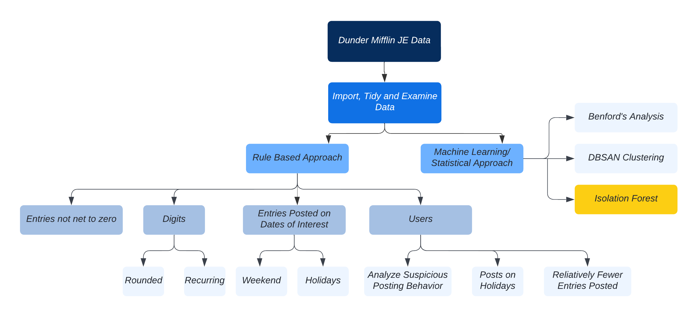

```{r setup, include=FALSE}
knitr::opts_chunk$set(cache = TRUE, warning = FALSE, 
                      message = FALSE, cache.lazy = FALSE)
```

# Problem 1

```{r echo=FALSE,out.width="20%", out.height="20%",fig.cap = '',out.extra='style="float:right; padding:10px"', warning=FALSE, message=FALSE}
knitr::include_graphics("dunder.png")
```

<b> <i> As part of the Deloitte Audit of Dunder Mifflin for FY15, you are tasked with identifying
any irregularities in the company’s general ledger. These irregularities could be anything
from an accidental typo (i.e., an extra 0) to a calculated fraud. You are assisting the
audit team to apply the best of Data Science to form risk based hypothesis.
The general ledger houses a company’s accounts and many journal entries are posted to
these accounts to either credit or debit balances. When checking journal entries for
outliers, typically a rules-based analysis is performed, such as identifying manually
entered journals that:  

* Do not net to zero
* Are above a particular amount
* Are posted by people that post relatively few journals
* Are round amounts (i.e. $32,000)
* Have particular words in the narration (note: the descriptive columns were omitted to
preserve the anonymity of the data)
* Are posted by certain people (i.e. the CEO)  

Your task is to use any analytical technique of your choice to identify outliers or
anomalies in this dataset. It does not have to follow the typical rules-based approach
above, but we are most interested in identifying journal postings that do not look like
‘business as usual’.
Note: The data used in this case study is of journal entries – financial postings to a
company’s general ledger. It has been anonymised by masking the true value of several
descriptive fields, removing some identifying columns and randomising the journal
amounts by a random factor. </i> <b>

### Assumptions

-   Assuming Dunder Mifflin is a paper company that has an annual revenue of `$100,000,000`. We set the materiality to be 1% of the revenue - `$1,000,000` and the clearly trivial threshold (CTT) to be `$10,000`.

-   We are only interested in looking at the manual entries. Thus, most of the analysis will be on these entries.

-   Users who post less than **5%** of the entries will be subjected to investigation.

-   For clustering, the business unit of interest is **2**


```{r, warning = FALSE, echo = FALSE}
library(data.table)
library(reticulate)
library(dplyr)
library(shiny)
library(ggplot2)
library(lubridate)
library(stringr)
library(rvest)
library(benford.analysis)
library(fpc)
library(dbscan)
library(factoextra)
library(solitude)
library(caret)
library(reshape2)
library(flextable)
library(devtools)
library(inspectdf)
library("DiagrammeR")
options(scipen=999)
```

### Approach

```{r echo=FALSE,out.width="125%", out.height="125%"}

```


```{r, eval = FALSE, echo = FALSE, fig.height=20, fig.width=20}
# flowchart
grViz("digraph {
  graph [layout = dot, rankdir = TB]
  
  node [fontname = Helvetica, shape = rectangle, style = filled,
  fillcolor = LightBlue, fontsize = 80, width = 18, height = 3]        
  tab1 [label = 'Dunder Mifflin JE Data']
  tab2 [label = 'Read in, Tiday Data and Examine']
  tab3 [label =  'Rule Based Approach']
  tab4 [label = 'Machine Learning/ Statistical Approach']
  tab5 [label = 'Benfords Analysis']
  tab6 [label = 'DBSCAN Clustering']
  tab7 [label = 'Isolation Forest', fillcolor = yellow ]
  tab8 [label = 'Entries Posted on\n Dates of Interest']
  tab9 [label = 'Holidays']
  tab10 [label = 'Weekend']
  tab11 [label = 'Users']
  tab12 [label = 'Analyze Suspicious User \n Posting Behavior']
  tab13 [label = 'Posts on Holidays']
  tab14 [label = 'Relatively Fewer Entries Posted']
  tab15 [label = 'Digits']
  tab16 [label = 'Recurring']
  tab17 [label = 'Round Amounts']

  
  # edge definitions with the node IDs
  tab1 -> tab2 -> tab3 -> tab8;
  tab2 -> tab4 -> tab5;
  tab4 -> tab6;
  tab4 -> tab7;
  tab8 -> tab9;
  tab8 -> tab10;
  tab3 -> tab11 -> tab12;
  tab11 -> tab13;
  tab11 -> tab14;
  tab3 -> tab15 -> tab16;
  tab15 -> tab17;

  }", height = 5000, width = 1000)
```

### Data Read In

```{r eval=FALSE, echo = FALSE}
filenames = list.files("Technical Assessment - Data Science/JET_CSV_DATA",
                       full.names = TRUE)
alldata_list = lapply(filenames, fread, sep = ",", colClasses = "character")
je_data = bind_rows(alldata_list)
# save in binary format for fast processing
saveRDS(je_data, file = "Technical Assessment - Data Science/je_data.rds")
# keep the relevant columns
je_data_filter = je_data %>% 
  select(1:4, 7:8, 10, 13:14, 16:17, 19:20, 27, 29:30 ) %>% 
  filter(Journal != "")
colnames(je_data_filter) = gsub(" ", "_", tolower(colnames(je_data_filter)))

# class conversion
je_data_filter$amount = as.numeric(je_data_filter$amount)
sum(je_data_filter$amount)

unique(unlist(lapply(strsplit(unique(je_data_filter$doc_date), "/"), function(x) x[[3]])))
# remove doc date and source date - does not seem to be a potential candidate for effective/ posted data
je_data_filter$doc_date = NULL
je_data_filter$source_date = NULL 

je_data_filter$post_date = as.Date(je_data_filter$post_date, "%d/%m/%Y")
je_data_filter$bat_cr_date = as.Date(je_data_filter$bat_cr_date, "%d/%m/%Y")

saveRDS(je_data_filter, file = "Technical Assessment - Data Science/je_data_filtered.rds")

je_manual = je_data_filter %>% 
  filter(journal == "Journal 2")

saveRDS(je_manual, 'Technical Assessment - Data Science/je_manual.RDS')
```

- Breakdown of data types - 

```{r, echo = FALSE, cache=TRUE}
# read the full data
je_data_filter = readRDS("je_data_filtered.rds")
# je_auto = readRDS("je_auto.RDS")
inspect_types(je_data_filter)  %>% show_plot()
```

- Data sizing information -

```{r, echo = FALSE}
inspect_mem(je_data_filter)  %>% show_plot()
```

<hr>

### Exploration & Insights

##### Amount Total

```{r, echo=FALSE}
amt_df = as.data.frame(sum(je_data_filter$amount))
colnames(amt_df) = "Amount"
amt_ft = flextable(amt_df)
amt_ft %>% 
  colformat_num(j = 1, prefix = "$") %>% 
  theme_vanilla() %>% 
  autofit()
```
  
We would expect the amount to net to zero, since all the journal entries are supposed to net. 

##### Date Ranges 

Since the data provided from Dunder Mifflin is an FY15 data, we would expect all the entries to be effective during FY15.

**Post Date:**

```{r, echo = FALSE}
pdate_df = as.data.frame(t(as.data.frame(range(je_data_filter$post_date))))
rownames(pdate_df) = ""
```

```{r, echo = FALSE}
pdate_ft = flextable(pdate_df)

pdate_ft %>% 
  set_header_labels(V1 = "Min", V2 = "Max") %>% 
  theme_vanilla() %>% 
  autofit()
```

**Bat Cr Date:**

```{r, echo = FALSE}
bdate_df = as.data.frame(t(as.data.frame(range(je_data_filter$bat_cr_date))))
rownames(bdate_df) = ""
```

```{r, echo = FALSE}
bdate_ft = flextable(bdate_df)

bdate_ft %>% 
  set_header_labels(V1 = "Min", V2 = "Max") %>% 
  theme_vanilla() %>% 
  autofit()
```

**Period summary with dates**

```{r, echo = FALSE}
# dates do not align with the period
date_ranges = je_data_filter %>%
  mutate(period = as.numeric(gsub("Period ", "", period))) %>% 
  group_by(period) %>% 
  summarise(min_post = min(post_date), max_post = max(post_date), min_eff = min(bat_cr_date), max_eff = max(bat_cr_date))
```

```{r echo=FALSE, results='asis'}
colnames(date_ranges) = c("Period", "Min Posted Date", "Max Posted Date", 
                          "Min Bat Cr Date", "Max Bat Cr Date")
date_range_ft = flextable(date_ranges)
date_range_ft %>% 
  theme_vanilla() %>% 
  autofit()
```

Even though the date ranges don't align with the period and none of the dates seem to be potential effective dates, I'm making the assumption that `post_date` is the date the entries were posted on and will be using it for my analysis.    

```{r, cache=TRUE, echo = FALSE}
je_manual = readRDS("je_manual.rds") 
je_manual$amount = round(je_manual$amount, 4)
# create debit and credit fields
je_manual$debit = ifelse(je_manual$amount > 0, abs(je_manual$amount), 0)
je_manual$credit = ifelse(je_manual$amount < 0, abs(je_manual$amount), 0)
```

<hr>


##### 1. Entries above a particular amount

The plots below show the distribution of our population based on the materiality and CTT values chosen - 
<br>

```{r, cache=TRUE, echo = FALSE}
# create intervals based on materiality
je_hist = je_data_filter %>% 
  mutate(interval =  cut(amount, c(min(amount) - 1, -1000000, 1000000, max(amount) + 1),
                         dig.lab = 10)) %>% 
  group_by(bat_name, interval) %>% 
  summarize(cnt = n()) %>% 
  group_by(interval) %>% 
  summarise(new_cnt = sum(cnt))

# create a bar plot and format the intervals 
ggplot(je_hist, aes(interval, new_cnt, fill = interval)) + 
  geom_bar(stat = "identity", width = 1) + 
  theme(legend.position = "none") +
  geom_text(aes(y = 1100, label= scales::comma(round(new_cnt)), vjust = 0)) + xlab("Amount Interval") + ylab("Line Count") + scale_x_discrete(labels = function(x) str_replace_all(x, regex(c("-" = "-$", ",1" = ",$1", "\\(1" = "\\($1")))) + scale_y_continuous(labels = scales::comma) +
  ggtitle("Distribution of Journal Entries based on Materiality")
```


```{r, cache=TRUE, echo = FALSE}
# create intervals based on materiality
je_hist_ctt = je_data_filter %>% 
  mutate(interval =  cut(amount, c(min(amount) - 1, -10000, 10000, max(amount) + 1),
                         dig.lab = 10)) %>% 
  group_by(bat_name, interval) %>% 
  summarize(cnt = n()) %>% 
  group_by(interval) %>% 
  summarise(new_cnt = sum(cnt))

# create a bar plot and format the intervals 
ggplot(je_hist_ctt, aes(interval, new_cnt, fill = interval)) + geom_bar(stat = "identity", width = 1) +  coord_cartesian(ylim = c(1000, 15000)) + theme(legend.position = "none") + scale_y_continuous(labels = scales::comma) +
  geom_text(aes(y = 1100, label= scales::comma(new_cnt)), vjust = 0) + xlab("Amount Interval") + ylab("Line Count") + scale_x_discrete(labels = function(x) str_replace_all(x, regex(c("-" = "-$", ",1" = ",$1", "\\(1" = "\\($1")))) +
  ggtitle("Distribution of Journal Entries based on CTT")
```

<hr>

##### 2. Manual entries that do not net to zero


```{r, cache=TRUE, echo = FALSE}
entries_not_net = je_manual %>% 
  group_by(bat_name) %>% 
  summarise(net_amt = sum(amount), net_deb = sum(debit), net_cred = sum(credit), cnt = n()) %>% 
  filter(abs(net_amt) > 1) %>% 
  arrange(desc(abs(net_amt)))

rm(je_data_filter)
```

There are `r nrow(entries_not_net)` manual entries that do not net to zero. Out of these, the entries above CTT that do not net to zero -

```{r, echo = FALSE}
entries_notnet_filter = je_manual %>% 
  mutate(above_ctt = ifelse(abs(amount) > 10000, "Yes", "No")) %>% 
  filter(above_ctt == "Yes") %>% 
  select(bat_name, amount, debit, credit) %>% 
  right_join(entries_not_net, by = "bat_name") %>% 
  filter(!is.na(amount))

entries_not_net_ctt = entries_not_net %>% 
  filter(bat_name %in% unique(entries_notnet_filter$bat_name))
  
colnames(entries_not_net_ctt) = c("JEID", "Amount", "Debit", "Credit", "Line Count")
entries_not_net_ft = flextable(head(entries_not_net_ctt))
entries_not_net_ft %>% 
  colformat_num(j = 2:4, prefix = "$") %>% 
  theme_vanilla() %>% 
  autofit()
```

Entries in the above table are worth looking into, since they do not net to zero. The ones with even line count could be worth bringing up to the client, as opposed to the odd ones, which suggest a potential missing entry.

<hr>

##### 3. Manual entries posted on a weekend/ holiday

-   Scraped holiday calendar from 2015
-   Performed a join with `post_date`  

```{r scrape, cache=TRUE, echo = FALSE}
# scrape australian holidays from 2015
url = "https://www.calendarlabs.com/holidays/australia/2015"
holiday <- url %>%
  read_html() %>%
  html_nodes('table') %>%
  html_table() %>% 
  .[[2]]

holiday$DATE = mdy(gsub(",", "",gsub(" ","-",gsub("(2015).*", "\\1", holiday$DATE))))
holiday$DAY = gsub("(y).*", "\\1", holiday$DAY)
# removing duplicate labor day
holiday = holiday[-4,]

holiday_ft = flextable(holiday)
holiday_ft %>%
  theme_vanilla() %>% 
  autofit()

rm(holiday_ft)
```

<br>

- Manual entries posted on holiday -

```{r echo=FALSE, cache=TRUE}
je_manual_holiday = left_join(je_manual, holiday, by = c("post_date" = "DATE"))  

# filter on entries posted on holiday 
holiday_plot = je_manual_holiday %>% 
  filter(!is.na(HOLIDAY)) %>% 
  group_by(bat_name, HOLIDAY) %>% 
  summarise(net_amt = round(sum(amount),4)) %>% 
  group_by(HOLIDAY) %>% 
  summarise(net_amt2 = sum(net_amt), new_cnt = n())

# filter on users who posted entries on holiday 
holiday_users = je_manual_holiday %>%
  mutate(above_ctt = ifelse(abs(amount) > 10000, "Yes", "No")) %>% 
  filter(!is.na(HOLIDAY) & above_ctt == "Yes") %>% 
  select(bat_name, post_user, amount, debit, credit, HOLIDAY, above_ctt) %>% 
  group_by(bat_name, post_user, HOLIDAY) %>% 
  summarise(net_amt = sum(amount), net_deb = sum(debit), net_cre = sum(credit), cnt = n()) 

holiday_user_118 = je_manual_holiday %>%
  filter(!is.na(HOLIDAY) & grepl("118", post_user)) %>% 
  select(bat_name, post_user, amount, debit, credit, HOLIDAY) %>% 
  group_by(bat_name, post_user, HOLIDAY) %>% 
  summarise(net_amt = sum(amount), net_deb = sum(debit), net_cre = sum(credit), cnt = n()) %>% 
  arrange(desc(net_deb))

rm(je_manual_holiday)

ggplot(holiday_plot, aes(HOLIDAY, fill = HOLIDAY)) +
  geom_bar(aes(y = net_amt2), stat = "identity", width = 1) +
  theme(axis.text.x = element_text(angle = 90, vjust = 0.5, hjust=1),
        legend.position = "none") + 
  geom_point(aes(y = new_cnt), size = 3) +
  scale_y_continuous(name = "Amount",
                     sec.axis = sec_axis(~., name = "Entry Count"),
                     labels=scales::dollar_format()) + 
  geom_text(aes(y = 200, label= new_cnt)) + ggtitle("Manual Journal Entries Posted on Holidays")
  
```

These entries could potentially indicate fraudulent entries that could have been posted without permission or a management override.

<hr>

- Entries posted on Saturday/ Sunday -

```{r, cache=TRUE, echo = FALSE}
# find weekday corresponding to posted date
je_manual$dayweek = wday(je_manual$post_date)

je_manual_dayweek = je_manual %>% 
  group_by(bat_name, dayweek) %>% 
  summarise(net_amt = round(sum(amount),4)) %>% 
  group_by(dayweek) %>%
  summarise(net_amt2 = sum(net_amt), new_cnt = n()) %>% 
  arrange(dayweek) %>% 
  mutate(dayweek = wday(dayweek, label = TRUE))

ggplot(je_manual_dayweek, aes(dayweek, fill = dayweek)) +
  geom_bar(aes(y = net_amt2), stat = "identity", width = 1) +
  theme(axis.text.x = element_text(angle = 90, vjust = 0.5, hjust=1),
        legend.position = "none") + 
  geom_point(aes(y = new_cnt), size = 3) +
  scale_y_continuous(name = "Amount", sec.axis = sec_axis(~., name = "Entry Count"),
                     breaks = seq(-3000, 10500, by = 2000),
                     labels=scales::dollar_format()) + 
  geom_text(aes(y = new_cnt, label= scales::comma(new_cnt)), hjust = 0.5, vjust = 2) +
  ggtitle("Manual Journal Entries Posted on Weekends")
```

Similarly, if the company doesn't work on weekends, there should be no reason to see entries being posted on Saturdays and Sundays.

<hr>

##### 4. Manual entries posted by users analysis

- Looking at all the user posting manual journal entries to find potential patterns -   

```{r, echo = FALSE}
# summarize the data on batch and user posted
je_user = je_manual %>% 
  group_by(bat_name, post_user) %>% 
  summarise(net_amt = round(sum(amount),2), net_deb = sum(debit), net_cred = sum(credit))
```


```{r, echo = FALSE}
# scatter plot to see users that stick out
je_manual_approver = je_user %>% 
  group_by(bat_name, post_user) %>% 
  summarise(deb = sum(net_deb), cre = sum(net_cred), amt = sum(net_amt)) %>% 
  group_by(post_user) %>% 
  summarise(deb = sum(deb), cre = sum(cre), amt = sum(amt), cnt = n())

approver_highlight = je_manual_approver %>% 
  filter(deb > 25000000, cnt < 500)

ggplot(je_manual_approver, aes(deb, cnt)) + 
  geom_text(aes(label = post_user), size = 2, vjust="inward",hjust="inward") +
  geom_text(data = approver_highlight, aes(x = deb, y = cnt, label = post_user), size = 2, color = "red", vjust="inward",hjust="inward") + scale_x_continuous(labels=scales::dollar_format()) +
  xlab("Debit") + 
  ylab("JE Count") + 
  ggtitle("User Posting Manual JE Lines")

rm(je_manual_approver)
```

Since Post User 109 and 118 stand out, we will dig deeper into their posting behaviors

```{r, echo = FALSE}
je_sus = je_manual %>% 
  filter(grepl("109|118", post_user)) %>% 
  group_by(bat_name, post_user, period) %>% 
  summarise(deb = sum(debit), cre = sum(credit), amt = sum(amount), cnt = n()) %>% 
  group_by(post_user, period) %>% 
  summarise(amt = abs(round(sum(amt), 2)), `JE Count` = n()*100000, Debit = sum(deb), Credit = sum(cre))

# convert data from wide to long to suit for the plot
je_susmelt = reshape2::melt(je_sus, id = c("post_user", "period")) %>% 
  filter(variable %in% c("Debit", "JE Count" ))

sus_per = factor(je_susmelt$period, level = paste("Period", 1:13))

ggplot(je_susmelt, aes(x = sus_per, y = value, color = variable)) +  
 xlab("Period") + theme(axis.text.x = element_text(angle = 90, vjust = 0.5, hjust=1)) +
  geom_line(aes(group = variable)) +  facet_wrap(. ~ post_user) +
  geom_point() +
  scale_y_continuous(name = "Debit", labels=scales::dollar_format(),
                     sec.axis = sec_axis(~./100000, name = "Line Count")) +
  scale_color_manual(name = "Measure", labels = c("Amount", "Line Count"),
                     values = c("#56B4E9", "#E69F00")) +
  ggtitle("Suspicious Users Posting Pattern")

```
  
    
    
From the above plot, we can see that Post User 118 posted few high dollar amount entries in period 6, while Post User 109 exhibited similar behavior in period 1.  

<br>

Taking a glimpse at the amounts of these unusual months - 

```{r, echo = FALSE}
je_sus = filter(je_sus, period %in%
                  c("Period 1", "Period 6")) %>%
  mutate(`JE Count` = `JE Count`/100000) %>% 
  select(1:3, 5:6, 4)
colnames(je_sus) = c("Post User", "Period", "Amount", "Debit", "Credit", "Entries Posted")
je_sus %>% 
  flextable() %>% 
  colformat_num(j = 2:4, prefix = "$") %>% 
  theme_vanilla() %>% 
  autofit()
```

<hr>

- Looking at users that post less than 5% of the manual journal entries -

```{r, echo = FALSE}
# summary on manual users
je_user_lt5 = head(je_user %>% 
  group_by(post_user) %>% 
  summarize(amount = sum(net_amt), net_deb = sum(net_deb),
            net_cred = sum(net_cred), cnt = n()) %>% 
  filter(cnt < 0.05*length(unique(je_manual$bat_name))) %>% 
  arrange(desc(amount)), 7)

colnames(je_user_lt5) = c("Post User", "Amount", "Debit", "Credit", "Entries Posted")
je_user_ft = flextable(je_user_lt5)
je_user_ft %>%
  colformat_num(j = 2:4, prefix = "$") %>% 
  highlight(i = 2, color = "yellow") %>% 
  theme_vanilla() %>% 
  autofit()
```

We can look into the titles of these users to identify any potential management override. Post User 118 pops up again! 

<hr>

- Users who posted on a holidays -  

```{r, echo = FALSE}
holiday_users_filter = holiday_users %>% 
  arrange(desc(net_amt)) 

colnames(holiday_users_filter) = c("JEID", "Post User", "Holiday", "Amount", "Debit",
                                   "Credit", "Count")

colnames(holiday_user_118) = c("JEID", "Post User", "Holiday", "Amount", "Debit",
                                   "Credit", "Count")


holiday_ft = flextable(rbind(head(holiday_users_filter), holiday_user_118[1,]))

holiday_ft %>% 
  colformat_num(j = 3:5, prefix = "$") %>% 
  highlight(i = 7, color = "yellow") %>% 
  theme_vanilla() %>% 
  autofit()

```

There were `r length(unique(holiday_users_filter[["Post User"]]))` unique users who posted entries on holidays above the set CTT of `$10,000`.  


<hr>

##### 5. Recurring digits, round amount and Benford's

- Recurring Digit

```{r, message=FALSE, echo = FALSE}
# remove -, "." from amount and round it
recur_amt <- as.character(round(je_manual$amount,4))
recur_amt <- str_replace(recur_amt,coll("-"),"")
recur_amt <- str_replace(recur_amt,coll("."),"")

recurr_dig = NA
# identify recurring digits in each amount
nchar_max <- max(nchar(recur_amt))-1
for (i in 1:nchar_max){
  recurr_dig <- ifelse(seq_along(recur_amt) %in%
                grep(paste0('([[:digit:]])\\1{',i,',}'),
                     recur_amt),
              i+1,
              recurr_dig)
}

# filtering by 4 and 5 digits
je_recur = je_manual %>% 
  mutate(recur = recurr_dig) %>% 
  filter(recur %in% c(4, 5)) %>% 
  group_by(bat_name, recur) %>% 
  summarise(amt = abs(sum(amount)), deb = sum(debit), cre = sum(credit)) %>% 
  group_by(recur) %>% 
  summarise(cnt = n(), net_amt = abs(sum(amt)), net_deb = sum(deb), net_cre = sum(cre))

ggplot(je_recur, aes(factor(recur), fill = recur)) +
  geom_bar(aes(y = net_amt), stat = "identity", width = 1, fill = c("light blue", "orange")) +
  theme(legend.position = "none") + xlab("Recurring Digit") +
  geom_point(aes(y = cnt), size = 3) +
  scale_y_continuous(name = "Absolute Amount", labels=scales::dollar_format(),
                     sec.axis = sec_axis(~., name = "Line Count")) + 
  geom_text(aes(y = cnt+10, label= scales::comma(cnt)), hjust = -0.25, vjust = -0.5) +
  ggtitle("Journal Entries with Recurring Digits")

# options(digits = 10)
recur_df = head(tibble(je_manual) %>% 
  mutate(recur = recurr_dig) %>% 
  filter(recur %in% c(4, 5)) %>% 
    distinct(bat_name, amount) %>% 
    select(2, 1) %>% 
    arrange(desc(amount)))

colnames(recur_df) = c("JEID", "Absolute Amount")
```

```{r, echo = FALSE}
recur_ft = flextable(recur_df)

recur_ft %>% 
  colformat_num(j = 2, prefix = "$") %>% 
  theme_vanilla() %>% 
  autofit()
```

Recurring digits could indicate potential fradulent entries and looking deeper into the description of those above CTT, it might be worth reaching out to the client.

- Round Amount

```{r, echo = FALSE}
# identify amounts directly divisible by multiples of 10
je_manual$roundamt <- ifelse(log10(abs(je_manual$amount)) %% 1 == 0,
                            abs(je_manual$amount), NA) 

je_round_entries = je_manual %>% 
  filter(!is.na(roundamt)) %>% 
  group_by(bat_name, roundamt) %>% 
  summarise(cnt = n()) %>% 
  select(bat_name, roundamt) %>% 
  arrange(desc(roundamt))

colnames(je_round_entries) = c("JEID", "Round Amount")

je_round_ft = flextable(head(je_round_entries))

je_round_ft %>% 
  colformat_num(j = 2, prefix = "$") %>% 
  theme_vanilla() %>% 
  autofit()
```

Since these amounts are a lot smaller than our CTT, we can ignore them.   

- Benford's Analysis -

```{r, echo=FALSE, cache=TRUE}
benf_result_first = benford(je_manual$amount, number.of.digits = 1)
plot(benf_result_first)
#benf_result_first
rm(benf_result_first)
```

While there is close conformity to Benford's distribution here, we can infer that there are more 7's than expected based on the chi-square plot. We also see the sum of these 7's is not meeting the average mark. This suggests there are significant low dollar value entries with leading digit 7.

##### 6. Duplicate Entries

The above table shows entries that contain the same combination of line accounts amounts for different JEIDs and are above threshold.  

```{r, echo=FALSE}
# duplicate entries
je_manual_jeidsumm = je_manual %>% 
  select(bat_name, account_no, amount) %>% 
  filter(abs(amount) > 10000) %>% 
  mutate(account_no = as.character(account_no), 
         amount = as.character(abs(round(amount, 2)))) %>% 
  group_by(bat_name, account_no, amount) %>% 
  summarize(cnt = n()) 

je_manual_acct_amt = je_manual_jeidsumm %>% 
  group_by(account_no, amount) %>% 
  summarize(cnt = n()) %>% 
  filter(cnt > 3)

je_manual_dups = je_manual_jeidsumm %>% 
  left_join(je_manual_acct_amt, by = c("account_no", "amount")) %>% 
  filter(!is.na(cnt.y)) %>% 
  select(-4, -5) %>% 
  distinct(bat_name, account_no, amount) %>% 
  arrange(bat_name, account_no)

colnames(je_manual_dups) = c("JEID", "Account Number", "Amount")

je_dups_df = je_manual_dups[1:13,]

je_dups_ft = flextable(je_dups_df)

je_dups_ft %>%
  flextable::highlight(i = 3:6, j = 2:3) %>% 
  theme_vanilla() %>% 
  autofit()

rm(je_manual_jeidsumm)
rm(je_manual_acct_amt)
```

The highlighted rows would be worth looking into with the client.

##### 7. DBSCAN

Feature Engineering

-   Cyclic encoding of dates
-   Addition of recurring digits, day of the week, holiday boolean to the data
-   Scaling amount
-   Filtered data to business unit `2`

```{r, cache=TRUE, echo = FALSE}
#cyclic encoding
encode_date = as.data.frame(cyclic_encoding(je_manual$post_date, c("week", "month")))
je_cluster = cbind(je_manual, encode_date)
rm(encode_date)
je_cluster = je_cluster %>% 
  left_join(holiday, by = c("post_date" = "DATE")) %>%
  mutate(recurr_dig = ifelse(is.na(recurr_dig) , 0,recurr_dig),
         holi_bool = ifelse(is.na(HOLIDAY), 0, 1), 
         amt = scale(amount)) %>% 
    filter(business_unit == "Business Unit 2") %>% 
  select(amt, dayweek, recurr_dig, holi_bool, sin.week, cos.week, sin.month,
         cos.month) 
# one hot encoding
# dummy = dummyVars(" ~ .", data = je_cluster)
# final_df = data.frame(predict(dummy, newdata=je_cluster))
```

```{r, cache = TRUE, echo = FALSE}
set.seed(220) 

Dbscan_cl <- dbscan::dbscan(je_cluster, eps = 1.8, minPts = 7)
je_cluster$clust = Dbscan_cl$cluster

fviz_cluster(Dbscan_cl, je_cluster, geom = "point")
```

```{r, echo = FALSE}

je_manual_bu2 = filter(je_manual, business_unit == "Business Unit 2") %>% 
  mutate(clust = Dbscan_cl$cluster) %>% 
  filter(clust == 0) %>% 
  select(bat_name, amount, debit, credit, dayweek)

colnames(je_manual_bu2) = c("JEID", "Amount", "Debit", "Credit", "Day of Week")

je_man_ft = flextable(je_manual_bu2)

je_man_ft %>% 
  colformat_num(j = 2:4, prefix = "$") %>% 
  theme_vanilla() %>% 
  autofit()
```


Based on DBSCAN, the above entry could be a potential anomaly. While the amount is less than CTT, the recurring digits and the fact that it is posted on a weekend suggest it is not business not as usual.  

```{r, echo = FALSE}
##### 3.1 Anomaly Detection in Users using Isolation Forest 

# je_manual_ano = je_manual %>% 
#   filter(amount > 1500) %>% 
#   select(bat_name, post_user, period, amount, debit, credit) %>% 
#   group_by(post_user, period) %>% 
#   summarise(amt = sum(round(amount,2)), deb = sum(debit), cre = sum(credit),
#             cnt_je = n()) 
# 
# library(solitude)
# iforest <- isolationForest$new()
# iforest$fit(je_manual_ano[,-1])
# myscores = je_manual_ano %>%
#  iforest$predict() %>%
#  arrange(desc(anomaly_score))
# samp = ifelse(myscores$anomaly_score >=0.70, "outlier", "normal")
# 
# users_inv = unique(je_manual_ano$post_user[samp == "outlier"])
# 
# je_manual_user_anomaly = filter(je_manual_ano, post_user %in% users_inv)
# 
# je_manual_user_anomaly$period_ex = as.numeric(gsub("Period ", "",je_manual_user_anomaly$period))
# 
# ggplot(je_manual_user_anomaly,
#        aes(period_ex, deb, group = post_user, color = post_user)) + geom_line() + 
#   geom_point() 
# 
# 
# je_manual_user_plot = je_manual_user_anomaly %>% 
#   group_by(source_user) %>%
#   summarize(cnt = sum(cnt_je), tot_amt = sum(round(amt, 2)))
# 
# ggplot(je_manual, aes(period, group = bat_name)) + geom_histogram(stat = "count")

```
